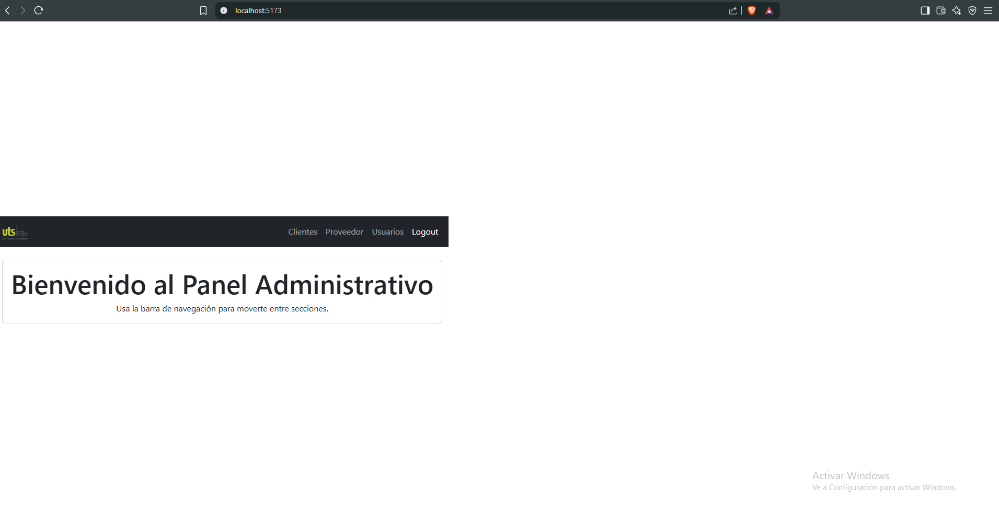

# React + Vite

This template provides a minimal setup to get React working in Vite with HMR and some ESLint rules.

Currently, two official plugins are available:

- [@vitejs/plugin-react](https://github.com/vitejs/vite-plugin-react/blob/main/packages/plugin-react) uses [Babel](https://babeljs.io/) for Fast Refresh
- [@vitejs/plugin-react-swc](https://github.com/vitejs/vite-plugin-react/blob/main/packages/plugin-react-swc) uses [SWC](https://swc.rs/) for Fast Refresh

## Expanding the ESLint configuration

If you are developing a production application, we recommend using TypeScript with type-aware lint rules enabled. Check out the [TS template](https://github.com/vitejs/vite/tree/main/packages/create-vite/template-react-ts) for information on how to integrate TypeScript and [`typescript-eslint`](https://typescript-eslint.io) in your project.


# Panel Administrativo Simple con React y Vite

Este es un proyecto de ejemplo que demuestra cómo construir un panel administrativo básico utilizando React, Vite, React Router DOM para la navegación y Bootstrap para los estilos.

## Características

*   Interfaz creada con React y Vite.
*   Navegación moderna sin recarga de página usando React Router DOM.
*   Barra de navegación con enlaces a las secciones: Clientes, Proveedor, Usuarios y Logout (simulado).
*   Estilizado con Bootstrap 5.
*   Estructura de proyecto organizada por componentes y páginas.

## Pasos Seguidos

1.  **Inicialización:** Proyecto creado con `npm create vite@latest --template react`.
2.  **Dependencias:** Instaladas `react-router-dom` y `bootstrap`.
3.  **Configuración:**
    *   Importado el CSS de Bootstrap en `src/main.jsx`.
    *   Envuelto el componente `App` con `BrowserRouter` en `src/main.jsx`.
4.  **Estructura:** Creadas carpetas `src/components` y `src/pages`.
5.  **Componentes:**
    *   `Navbar.jsx`: Barra de navegación con logo y enlaces usando `NavLink`.
    *   Páginas (`Home.jsx`, `Clientes.jsx`, etc.): Componentes simples para cada sección.
6.  **Enrutamiento:** Configurado en `App.jsx` usando `<Routes>` y `<Route>`.
7.  **Estilos:** Clases de Bootstrap aplicadas directamente en los componentes JSX.

## Cómo Ejecutar el Proyecto

1.  Clona este repositorio (si está en GitHub) o asegúrate de tener el código.
2.  Abre una terminal en la carpeta raíz del proyecto.
3.  Instala las dependencias:
    ```bash
    npm install
    ```
4.  Inicia el servidor de desarrollo:
    ```bash
    npm run dev
    ```
5.  Abre tu navegador y visita la URL proporcionada (generalmente `http://localhost:5173`).

## Captura de Pantalla




*(Asegúrate de guardar una imagen llamada `screenshot.png` en la raíz del proyecto)*

## Próximos Pasos (Ideas)

*   Implementar lógica real para el botón Logout (manejo de estado de autenticación).
*   Añadir contenido real a las páginas (tablas, formularios, etc.).
*   Integrar un backend para obtener datos dinámicos.
*   Mejorar la gestión del estado (Context API, Redux, Zustand).
